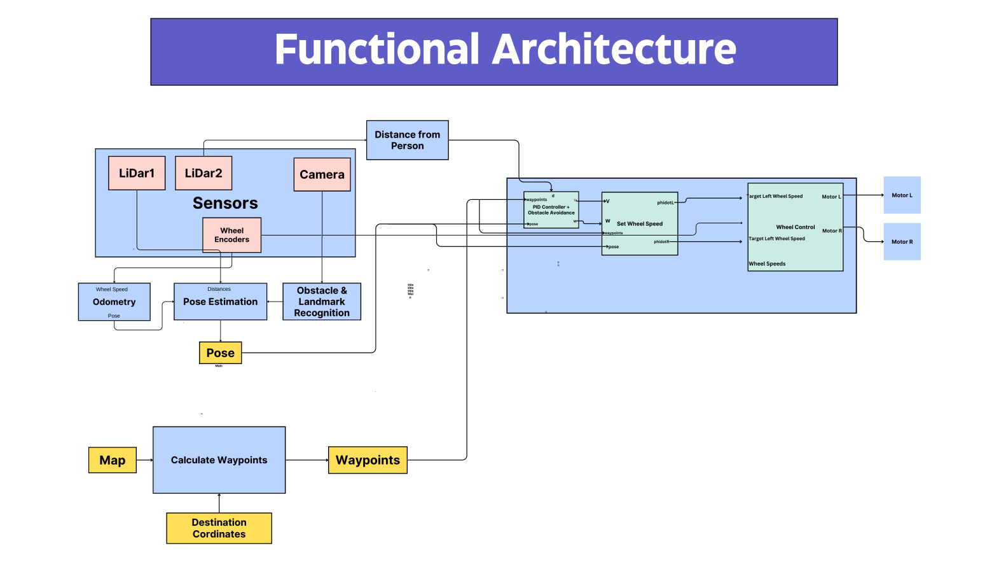

# Autonomous Wheeled Mobile Robots for Indoor Navigation to Assist the Visually Impaired

This is our project for the course Mobile Robotics made by Lyeba Abid, Ali Muhammad Asad, Sadiqah Mushtaq, and Syed Muhammad Ali Naqvi, under the supervision of Dr. Basit Memon. This project aims to develop a simulation on Gazebo, using ROS and MATLAB Simulink to develop a simulation on an autonomous wheeled mobile robot that can help the visually impaired navigate through different settings with ease and efficiency. 

Navigating unfamiliar indoor spaces can be an incredibly challenging task for individuals with visual impairments, as they often rely on canes, guide dogs, or verbal directions from others. Our motivation for this project is to provide a more independent and efficient solution, leveraging advanced robotics to assist visually impaired individuals in finding the shortest and safest path to their destination while avoiding obstacles along the way. In this project, the user will hold the robot, which will not only act as a guide but also serve as a walking cane, ensuring a smooth and reliable journey.

More details can be found in the [Project Proposal](Project Proposal.pdf) document in the repository.

The tentative [functional architecture](Functional Architecture.pdf) has been given, and a tentative image is attached below:

 

### Project Staus: Initial Stages - Literature Review

#### Literature Review:
* [Vision-Based Mobile Robot Controllers: A Scientific Review (2021)](https://www.researchgate.net/publication/351082201_Vision-Based_Mobile_Robot_Controllers_A_Scientific_Review)
* [Critical Design and Control Issues of Indoor Autonomous Mobile Robots: A Review (2021)](https://sci-hub.zidianzhan.net/10.1109/access.2021.3062557)
* [Developments and Challenges in Wheeled Mobile Robot Control](https://www.researchgate.net/publication/280578831_Developments_and_Challenges_in_Wheeled_Mobile_Robot_Control)
* [Review on Autonomous Indoor Wheel Mobile Robot Navigation Systems (2020)](https://sci-hub.zidianzhan.net/10.1109/icABCD49160.2020.9183838)
* [Autonomous mobile robot navigation in uneven and unstructured indoor environments](https://sci-hub.zidianzhan.net/10.1109/IROS.2017.8202145)
* [An Edge Computing Platform of Guide-dog Robot for Visually Impaired](https://sci-hub.zidianzhan.net/10.1109/ISADS45777.2019.9155620)
* [Research on Design and Motion Control of a Considerate Guide Mobile Robot for Visually Impaired People](https://ieeexplore.ieee.org/document/10158527)