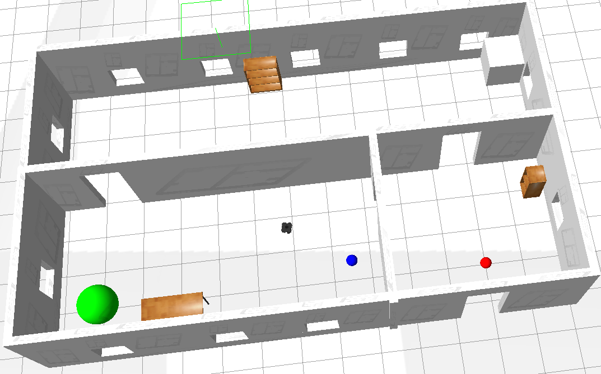

# Smart Walking Cane for Indoor Navigation for the Visually Impaired

## Table of Contents:
* [Introduction](#Introduction)
* [Technologies and Softwares Used](#Technologies-and-Softwares-Used)
* [The Challenge and Our Solution](#The-Challenge-and-Our-Solution)
* [Installation and Setup](#Installation-and-Setup)
    * [Running Our Model](#Running-Our-Model)
* [Features and Functionality](#Features-and-Functionality)
    * [Robot System Architecture](#Robot-System-Architecture)
    * [Path Planning](#Path-Planning)
    * [Path Following](#Path-Following)
    * [Obstacle Avoidance](#Obstacle-Avoidance)

## Introduction
This is our project for the course ```Mobile Robotics```, made by Lyeba Abid, Ali Muhammad Asad, Sadiqah Mushtaq, and Syed Muhammad Ali Naqvi under the supervision of Dr. Basit Memon. This project aims to develop an innovative Smart Walking Cane designed for visually impaired individuals. Leveraging advanced technologies like LIDAR sensors, ROS middleware, and Matlab/Simulink integration with Gazebo, our solution offers enhanced indoor navigation through effective path planning and object detection capabilities

## Technologies and Softwares Used


At the heart of the project is the development of a simulation using ```Gazebo```, integrated with ```ROS``` as a middleware, and ```MATLAB Simulink```. Our focus is on crafting an autonomous mobile robot in the form of a cane that serves not just as a navigational aid but also as a beacon of independance for visually impaired individuals. The image to the right shows an example of a wheeled walking cane that can be modelled as an extension to the Turtlebot simulation model. 

<em>*For the purpose of simulation, the navigation cane is modelled as a wheeled mobile robot - the Gazebo Turtlebot serves as a model which acts as an assistive cane in our case.</em>

## The Challenge and Our Solution
Navigating through unfamiliar indoor environments poses a significant challenge for people with visual impairments. Traditional aids like canes or guide dogs, while helpful, have limitations in terms of autonomy and efficiency. Our project aims to transcend these boundaries by harnessing the power of modern robotics.

Our solution is a smart walking cane, a robotic guide that offers the dual functionality of a traditional cane and an intelligent navigational assistant. This autonomous robot is designed to guide the user through complex environments, ensuring the shortest, safest path to their desired destination. By avoiding obstacles and navigating efficiently, the cane promises a new level of independence and safety for its users. In addition, the person's gait and moving speed will also be taken into account to make the cane more user friendly by adjusting its speed accordingly.

More details can be found in our initial [Project Proposal](Project_Proposal.pdf) document. 


## Installation and Setup
```MATLAB``` is a requirement, and can be installed [here](https://matlab.mathworks.com/), along with ```Navigation Toolbox```, and ```ROS Toolbox``` add-ons. As stated above, ```Gazebo``` simulator engine is used for simulating the ```ROS``` based robot. More information about Gazebo can be found [here](https://gazebosim.org/home), and installation can be done over [here](https://gazebosim.org/docs). If you are new and don't have Gazebo installed prior, we recommend doing it through a virtual machine, as ROS and Gazebo require a Linux (64-bit) environment. In addition, although we did have an Ubuntu based distro, plugins still weren't supported for our distro, but for only some specific distros. Therefore, we would recommend using a virtual machine, with pre-installed ROS and Gazebo frameworks to save oneself from the headache we suffered. The comprehensive link with platform-specific installation instructions can be found [here](https://www.mathworks.com/support/product/robotics/ros2-vm-installation-instructions-v9.html). In addition, co-simulation between Simulink and Gazebo can be performed via instruction given in the link [here](https://www.mathworks.com/help/robotics/ug/perform-co-simulation-between-simulink-and-gazebo.html).

### Running Our Model
Once you've opened ```Gazebo```, open the ```Gazebo Office``` environment on your virtual machine, and note your ip-address. Once you've opened MATLAB, on the host computer run the following commands to initialize ROS global node in MATLAB and connect to the ROS master in the virtual machine through its IP address ipaddress. Replace ipaddress with the IP address of your TurtleBot in virtual machine. 

```
ipaddress = '192.168.128.128'
rosinit(ipaddress, 11311)
```

You can disable the link by running the below command:
```
rosshutdown
```

The layout of the simulated office environment is like shown:



To run our model, 

## Features and Functionality
### Robot System Architecture
Our system comprises of 4 main components:
<ul>
<li>Localization (EKF-based Localization)</li>
<li>Path Planning</li>
<li>Path Following</li>
<li>Obstacle Avoidance</li>
</ul>


The Path Planning and Localization block, takes a destination within the indoor environment and makes use of A-star path planning algorithm to generate a set of way points for the robot to follow. The robot uses the sensor readings and odometric calculations and apply localization techniques to estimate the robot pose. This information is then used by the path following control block to generate velocities. This block also adjusts the velocity according to the movement of the user. This data is then fed to Obstacle Avoidance block which avoids any unforeseen obstacles which are not a part of the map. Finally the control velocities are generated and published to the robot motors. The functional architecture is also shown below in the figure. While traditional models make use of only object detection and obstacle avoidance, our model also makes use of localization and path planning to not only warn the user of potential obstacles, but also guide the user to a set destination if required. 

### Path Planning


We have employed MATLAB and the Robotics System Toolbox to implement a path planning scenario utilizing the A* algorithm within the grid-based Gazebo office environment. We have strategically set starting and goal points within the Cartesian coordinate system, delineating the commencement and destination of our robotic trajectory. The plannerAStarGrid class, driven by the A* algorithm, has dynamically computed an optimal, collision-free path on the Gazebo office map.

### Path Following
In the pursuit of precise path following for our robotic system in the indoor navigation project, we employ the Pure Pursuit algorithm — a well-established method for tracking a desired trajectory. The primary objective of this algorithm is to guide the robot along a predefined path, optimizing its trajectory to closely match the intended course. The core idea revolves around determining a point on the path, known as the "lookahead point,” and directing the robot to navigate towards it. The pure pursuit algorithm uses the current robot pose and the waypoints obtained through filtering and path planning from the previous block and generates the velocity commands. 


### Obstacle Avoidance
Our robot employs the VFH algorithm for obstacle avoidance, analyzing range sensor data to navigate through environments. Seamlessly integrated into our path-following system, VFH optimizes steering directions for effective obstacle avoidance and precise target pursuit. The system’s adaptive velocity adjustments accommodate both clear and ambiguous steering scenarios, ensuring efficient navigation in diverse environments. 


<!-- This is our project for the course Mobile Robotics made by Lyeba Abid, Ali Muhammad Asad, Sadiqah Mushtaq, and Syed Muhammad Ali Naqvi, under the supervision of Dr. Basit Memon. This project aims to develop a simulation on Gazebo, using ROS and MATLAB Simulink to develop a simulation on an autonomous wheeled mobile robot that can help the visually impaired navigate through different settings with ease and efficiency. 

Navigating unfamiliar indoor spaces can be an incredibly challenging task for individuals with visual impairments, as they often rely on canes, guide dogs, or verbal directions from others. Our motivation for this project is to provide a more independent and efficient solution, leveraging advanced robotics to assist visually impaired individuals in finding the shortest and safest path to their destination while avoiding obstacles along the way. In this project, the user will hold the robot, which will not only act as a guide but also serve as a walking cane, ensuring a smooth and reliable journey.

More details can be found in the [Project Proposal](Project_Proposal.pdf) document in the repository.

The tentative [functional architecture](Functional_it
Architecture.pdf) has been given, and a tentative image is attached below:

  

<pre>

</pre>

### Project Staus: Initial Stages - Literature Review

#### Literature Review:
* [Vision-Based Mobile Robot Controllers: A Scientific Review (2021)](https://www.researchgate.net/publication/351082201_Vision-Based_Mobile_Robot_Controllers_A_Scientific_Review)
* [Critical Design and Control Issues of Indoor Autonomous Mobile Robots: A Review (2021)](https://sci-hub.zidianzhan.net/10.1109/access.2021.3062557)
* [Developments and Challenges in Wheeled Mobile Robot Control](https://www.researchgate.net/publication/280578831_Developments_and_Challenges_in_Wheeled_Mobile_Robot_Control)
* [Review on Autonomous Indoor Wheel Mobile Robot Navigation Systems (2020)](https://sci-hub.zidianzhan.net/10.1109/icABCD49160.2020.9183838)
* [Autonomous mobile robot navigation in uneven and unstructured indoor environments](https://sci-hub.zidianzhan.net/10.1109/IROS.2017.8202145)
* [An Edge Computing Platform of Guide-dog Robot for Visually Impaired](https://sci-hub.zidianzhan.net/10.1109/ISADS45777.2019.9155620)
* [Research on Design and Motion Control of a Considerate Guide Mobile Robot for Visually Impaired People](https://ieeexplore.ieee.org/document/10158527) -->